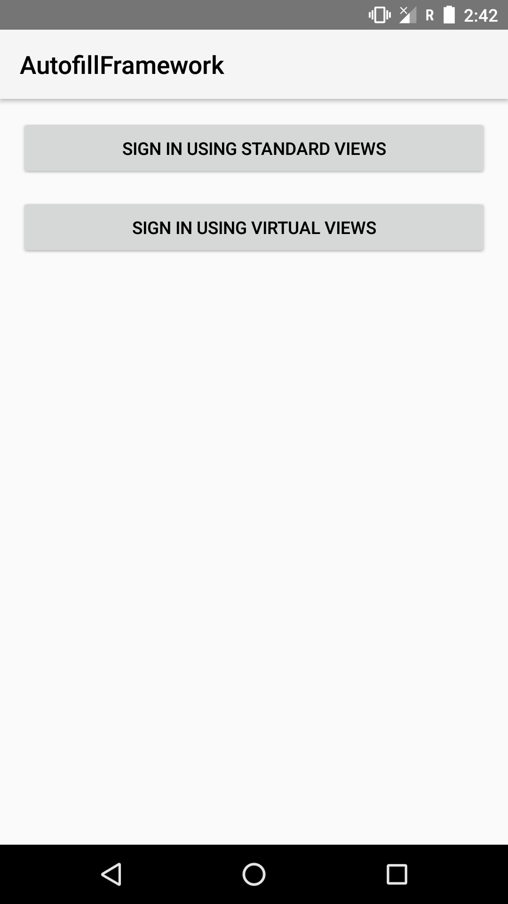
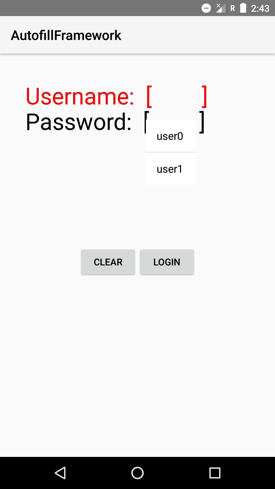
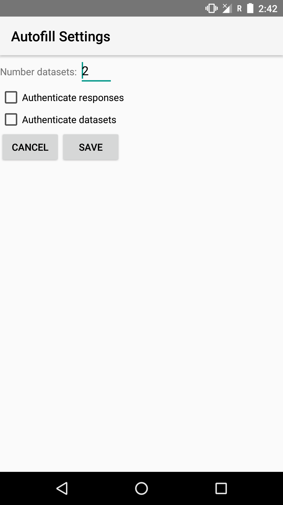
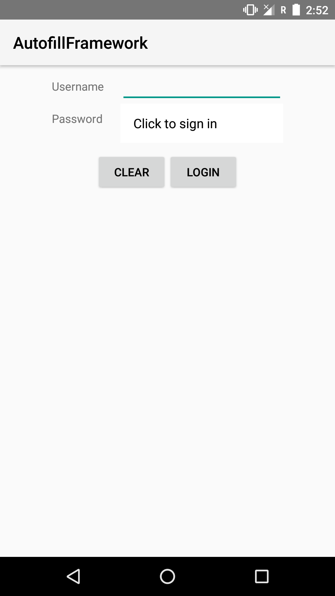

Android AutofillFramework Sample (Kotlin)
===================================

This sample demonstrates the use of the Autofill Framework. It includes implementations of client
Activities that want to be autofilled, and a Service that can provide autofill data to client
Activities. For simplicity, this sample's service uses mock data to autofill what it thinks are
username and password text fields.

Introduction
------------

This sample demonstrates the use of the Autofill framework from the service side and the client
side. In practice, only a small handful of apps will develop Autofill services because a device will
only have one service as default at a time. However, all apps targeting O with any autofillable
fields should follow the necessary steps to ensure their Views can be autofilled. Most of the time,
there is little to no extra code involved, but the use of custom views and views with virtual child
views requires more work.

The sample's Autofill service is implemented to parse the client's view hierarchy in search of text
fields that it has data for. If such text fields exist in the hierarchy, the service sends data
suggestions to the client to fill in those text fields. In this basic sample, it will only look for
views whose resource IDs are "usernameField" and "passwordField" and will send mock credential data
accordingly. A real Autofill service would attempt to autofill more than just login credentials and
would be able to fill in other view types in addition to text fields (e.g. spinners, checkboxes,
etc.). It would also use more advanced heuristics to determine what data to send to which views.

To set the device's default Autofill service to the one in the sample, edit
**Settings** > **Apps &amp; Notifications** > **Default Apps** > **Auto-fill app** and select the
sample app. To edit the service's settings, open the **Autofill Settings** launcher icon. Here, you
can set whether you want to enable authentication on the entire Autofill Response or just on
individual datasets. You can also set the number of mock datasets that are sent to the client app.

The client side of the app has two Activities that each have a username field and a password field.
One of the Activities uses standard views and the other Activity uses a custom view with virtual
children. The standard views do not require any extra code to allow autofill. The following code
example shows the `View` method you have to override in order to provide view hierarchy data to the
Autofill service. This is triggered when the `View` goes into focus and Android invokes an Autofill
request.

```java
/*
This method is responsible for building the ViewStructure that gets passed to the AutoFillService
by the framework when it is time to find Autofill suggestions. To do this, it should traverse
through its view hierarchy and add views to the ViewStructure on the way.
*/
@Override
public void onProvideAutoFillVirtualStructure(ViewStructure structure, int flags) {
  structure.setClassName(getClass().getName());
  int childrenSize = mItems.size();
  int index = structure.addChildCount(childrenSize);
  for (int i = 0; i < childrenSize; i++) {
      Item item = mItems.valueAt(i);
      ViewStructure child = structure.newChild(index, item.id, flags);
      child.setSanitized(item.sanitized);
      child.setText(item.text);
      child.setAutoFillValue(AutoFillValue.forText(item.text));
      child.setFocused(item.line.focused);
      child.setId(item.id, getContext().getPackageName(), null, item.line.idEntry);
      index++;
  }
}
```

After the service processes the Autofill request and sends back a series of Autofill `Datasets`
(wrapped in a `Response` object), the user can pick which `Dataset` they want to autofill their
views with. When a `Dataset` is selected, this method is invoked for all of the views that were
associated with that `Dataset` by the service. For example, the `Dataset` might contain Autofill
values for username, password, birthday, and address. This method would then be invoked on all four
of those fields. The following code example shows how the sample app implements the method to
deliver a UI update to the appropriate child view after the user makes their selection.

```java
/*
User has just selected a Dataset from the list of Autofill suggestions and the Dataset's
AutoFillValue gets passed into this method. This method updates the UI based on the data
in the AutoFillValue.
*/
@Override
public void autoFillVirtual(int id, AutoFillValue value) {
  Item item = mItems.get(id);
  if (item == null) {
      // ID not recognized so no-op.
      return;
  }
  if (!item.editable) {
      // Component is not editable so no-op.
      return;
  }
  // Set the virtual child view's text to the text wrapped in the AutoFillValue.
  item.text = value.getTextValue();
  postInvalidate();
}
```

Pre-requisites
--------------

- Android SDK Preview O
- Android Build Tools v25.0.3
- Android Support Repository

Screenshots
-------------

         

Getting Started
---------------

This sample uses the Gradle build system. To build this project, use the
"gradlew build" command or use "Import Project" in Android Studio.

Support
-------

- Google+ Community: https://plus.google.com/communities/105153134372062985968
- Stack Overflow: http://stackoverflow.com/questions/tagged/android

If you've found an error in this sample, please file an issue:
https://github.com/googlesamples/android-AutofillFramework

Patches are encouraged, and may be submitted by forking this project and
submitting a pull request through GitHub. Please see CONTRIBUTING.md for more details.

License
-------

Copyright 2017 The Android Open Source Project, Inc.

Licensed to the Apache Software Foundation (ASF) under one or more contributor
license agreements.  See the NOTICE file distributed with this work for
additional information regarding copyright ownership.  The ASF licenses this
file to you under the Apache License, Version 2.0 (the "License"); you may not
use this file except in compliance with the License.  You may obtain a copy of
the License at

http://www.apache.org/licenses/LICENSE-2.0

Unless required by applicable law or agreed to in writing, software
distributed under the License is distributed on an "AS IS" BASIS, WITHOUT
WARRANTIES OR CONDITIONS OF ANY KIND, either express or implied.  See the
License for the specific language governing permissions and limitations under
the License.
