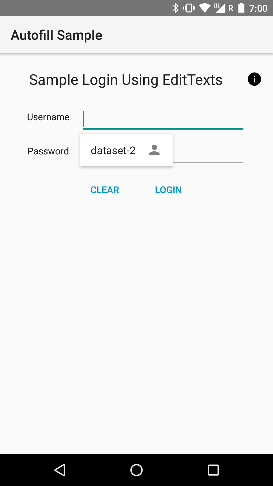
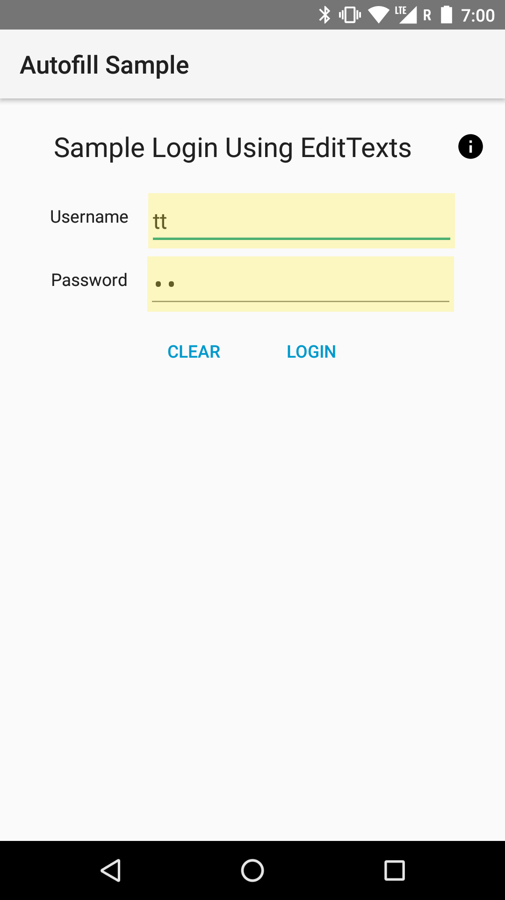
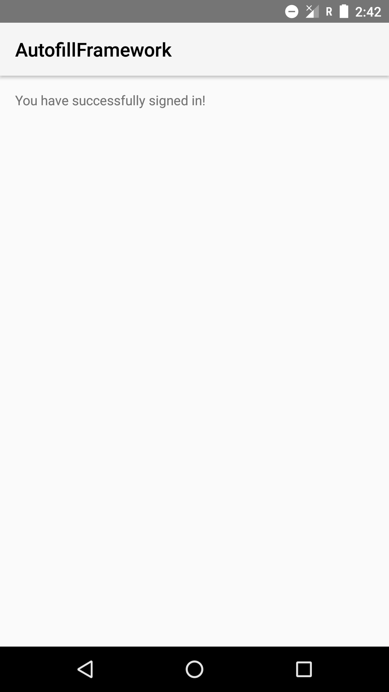
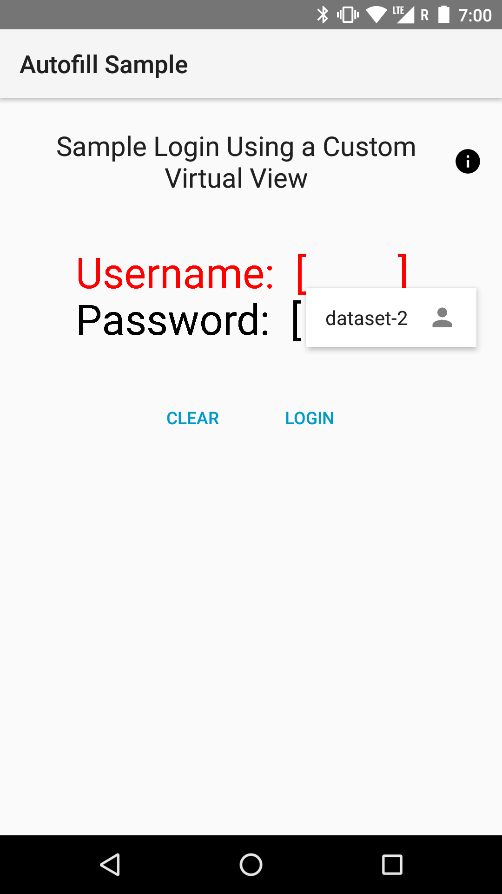
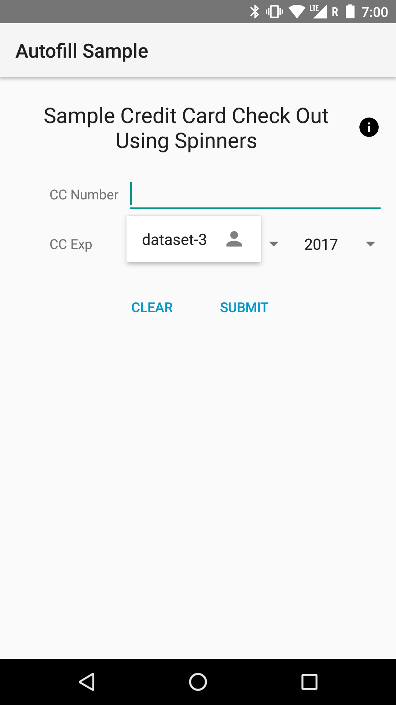
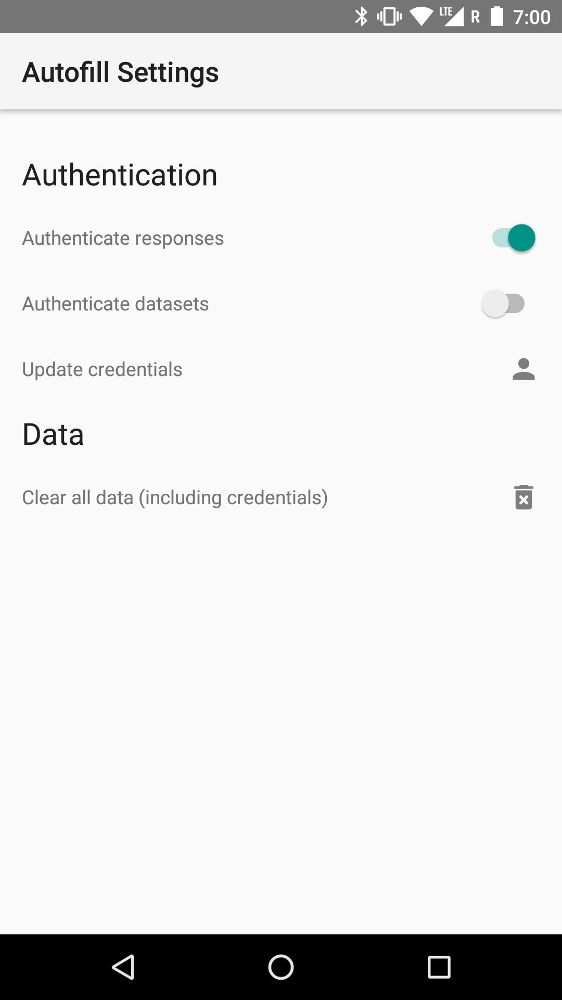

Android AutofillFramework Sample
===================================

This sample demonstrates the use of the Autofill Framework. It includes implementations of client
Activities with views that should be autofilled, and a Service that can provide autofill data to
client Activities.

Introduction
------------

This sample demonstrates the use of the Autofill framework from the service side and the client
side. In practice, only a small handful of apps will develop Autofill services because a device
will only have one service as default at a time, and there is just a small number of 3rd-party apps
providing these services (typically password managers). However, all apps targeting O with any
autofillable fields should follow the necessary steps to 1) ensure their views can be autofilled
and 2) optimize their autofill performance. Most of the time, there is little to no extra code
involved, but the use of custom views and views with virtual child views requires more work.

The sample's Autofill service is implemented to parse the client's view hierarchy in search of
autofillable fields that it has data for. If such fields exist in the hierarchy, the service sends
data suggestions to the client to autofill those fields. The client uses the following attributes
to specify autofill properties: `importantForAutofill`, `autofillHints`, and `autofillType`.
`importantForAutofill` specifies whether the view is autofillable. `autofillHints` is a list of
strings that hint to the service **what** data to fill the view with. This sample service only
supports the hints listed [here](https://developer.android.com/reference/android/view/View.html#AUTOFILL_HINT_CREDIT_CARD_EXPIRATION_DATE)
with the prefix AUTOFILL_HINT_*. `autofillType` tells the service the type of data it expects to
receive (i.e. a list index, a date, or a string). Specifying `autofillType` is only necessary
when implementing a custom view since all of the provided widgets in the UI toolkit do this for you.

To set the device's default Autofill service to the one in the sample, edit **Settings** >
**System** > **Languages &amp; Input** > **Advanced** > **Auto-fill service** and select the sample
app. To edit the service's settings, tap the settings icon next to the **Auto-fill service** list
item or open the **Autofill Settings** launcher icon.. Here, you can set whether you want to enable
authentication on the entire autofill Response or just on individual autofill datasets. You should
also set the master password to “unlock” authenticated autofill data with.

**Note:** This sample service stores all autofill data in SharedPreferences and thus is not secure.
Be careful about what you store when experimenting with the sample because anyone with root access
to your device will be able to view your autofill data.

The client side of the app has three Activities that each have autofillable fields. The first
Activity uses standard views to comprise a login form. Very little needs to be done by the client
app to ensure the views get autofilled properly. The second Activity uses a custom view with
virtual children, meaning some autofillable child views are not known to the View hierarchy to be
child views. Supporting autofill on these child views is a little more involved.

The following code snippet shows how to signal to the autofill service that a specific
autofillable virtual view has come into focus:

```kotlin
class CustomVirtualView(context: Context, attrs: AttributeSet) : View(context, attrs) {
...
    // Cache AutofillManager system service
    private val autofillManager: AutofillManager = context.getSystemService(AutofillManager::class.java)
...
    // Notify service which virtual view has come into focus.
    autofillManager.notifyViewEntered(this@CustomVirtualView, id, absBounds)
...
    // Notify service that a virtual view has left focus.
    autofillManager.notifyViewExited(this@CustomVirtualView, id)
}
```

Now that the autofillable view has signaled to the service that it has been autofilled, it needs
to provide the virtual view hierarchy to the Autofill service. This is done out of the box for
views part of the UI toolkit, but you need to implement this yourself if you have the view has
virtual child views. The following code example shows the `View` method you have to override in
order to provide this view hierarchy data to the Autofill service.

```kotlin
override fun onProvideAutofillVirtualStructure(structure: ViewStructure, flags: Int) {
    // Build a ViewStructure to pack in AutoFillService requests.
    structure.setClassName(javaClass.name)
    val childrenSize = items.size()
    Log.d(TAG, "onProvideAutofillVirtualStructure(): flags = " + flags + ", items = "
            + childrenSize + ", extras: " + bundleToString(structure.extras))
    var index = structure.addChildCount(childrenSize)
    // Traverse through the view hierarchy, including virtual child views. For each view, we
    // need to set the relevant autofill metadata and add it to the ViewStructure.
    for (i in 0..childrenSize - 1) {
        val item = items.valueAt(i)
        Log.d(TAG, "Adding new child at index $index: $item")
        val child = structure.newChild(index)
        child.setAutofillId(structure, item.id)
        child.setAutofillHints(item.hints)
        child.setAutofillType(item.type)
        child.setDataIsSensitive(!item.sanitized)
        child.text = item.text
        child.setAutofillValue(AutofillValue.forText(item.text))
        child.setFocused(item.focused)
        child.setId(item.id, context.packageName, null, item.line.idEntry)
        child.setClassName(item.className)
        index++
    }
}
```

After the service processes the Autofill request and sends back a series of Autofill `Datasets`
(wrapped in a `Response` object), the user can pick which `Dataset` they want to autofill their
views with. When a `Dataset` is selected, this method is invoked for all of the views that were
associated with that `Dataset` by the service. For example, the `Dataset` might contain Autofill
values for username, password, birthday, and address. This method would then be invoked on all
four of those fields. The following code example shows how the sample app implements the method
to deliver a UI update to the appropriate child view after the user makes their selection.

```kotlin
override fun autofill(values: SparseArray<AutofillValue>) {
    // User has just selected a Dataset from the list of autofill suggestions.
    // The Dataset is comprised of a list of AutofillValues, with each AutofillValue meant
    // to fill a specific autofillable view. Now we have to update the UI based on the
    // AutofillValues in the list.
    for (i in 0..values.size() - 1) {
        val id = values.keyAt(i)
        val value = values.valueAt(i)
        items[id]?.let { item ->
            if (item.editable) {
                // Set the item's text to the text wrapped in the AutofillValue.
                item.text = value.textValue
            } else {
                // Component not editable, so no-op.
            }
        }
    }
    postInvalidate()
}
```

Pre-requisites
--------------

- Android SDK Preview O
- Android Studio 3.0+
- Android Build Tools v26+
- Android Support Repository v26+
- Gradle v3.0+

Screenshots
-------------

           

Getting Started
---------------

This sample uses the Gradle build system. To build this project, use the
"gradlew build" command or use "Import Project" in Android Studio.

Support
-------

- Google+ Community: https://plus.google.com/communities/105153134372062985968
- Stack Overflow: http://stackoverflow.com/questions/tagged/android

If you've found an error in this sample, please file an issue:
https://github.com/googlesamples/android-AutofillFramework

Patches are encouraged, and may be submitted by forking this project and
submitting a pull request through GitHub. Please see CONTRIBUTING.md for more details.

License
-------

Copyright 2017 The Android Open Source Project, Inc.

Licensed to the Apache Software Foundation (ASF) under one or more contributor
license agreements.  See the NOTICE file distributed with this work for
additional information regarding copyright ownership.  The ASF licenses this
file to you under the Apache License, Version 2.0 (the "License"); you may not
use this file except in compliance with the License.  You may obtain a copy of
the License at

http://www.apache.org/licenses/LICENSE-2.0

Unless required by applicable law or agreed to in writing, software
distributed under the License is distributed on an "AS IS" BASIS, WITHOUT
WARRANTIES OR CONDITIONS OF ANY KIND, either express or implied.  See the
License for the specific language governing permissions and limitations under
the License.
